# WebFeaturesScanReport: Claude-Powered Browser Compatibility Reporter

This repository contains Terraform and Lambda code used to extend the webfeatures scan tool(https://github.com/nnnpsk/scanora) with an automated HTML compatibility report generator driven by large models hosted via AWS Bedrock (example: Anthropic Claude via Bedrock).

This README explains the repository layout, the purpose of every Terraform file and, the export helper scripts (how they were created and how to use them, if needed)

## Repository

- `terraform/` — Terraform configuration  
  - `main.tf` — Terraform provider information (AWS provider and required versions).
  - `apigateway.tf` — API Gateway (REST API v1) resources: REST API, resource path, methods, integration to `infer` Lambda, model and request validator, usage plan and API key, stage + access logging.
  - `lambda.tf` — Lambda function resources and lambda permission for API Gateway invocation. Creates two primary functions: `infer` and `worker`.
  - `s3.tf` — CloudTrail bucket and a scan tool bucket for inputs and HTML outputs. Creates prefixes for JSON and HTML folders and configures encryption/versioning/public access block.
  - `iam.tf` — IAM roles and policies needed for API Gateway, Bedrock, CloudWatch, Secrets Manager, S3 and Lambda execution policies.
  - `cloudwatch.tf` — CloudWatch Log Groups used by API Gateway, Lambdas, Bedrock, WAF and other services.
  - `cloudtrail.tf` — CloudTrail trail that writes to an S3 bucket 
  - `bedrock.tf` — AWS Bedrock guardrail config (content filters / policy enforcement for model inputs/outputs).
  - `sm.tf` — Secrets Manager secret resource for storing the Bedrock API key. 
  - `waf.tf` — WAF to protect the API
  - `variables.tf` — List of variables used by the Terraform code
  - `src/` — Lambda code and sample payload
    - `infer.py` / `infer.zip` — receives requests from the WebFeatures scan json report, uploads JSON + placeholder HTML to S3, returns a presigned URL, and invokes `worker` asynchronously
    - `worker.py` / `worker.zip` — reads JSON from S3, calls Bedrock to build the HTML report, uploads final HTML to S3
      
- `exports/` — helper scripts to export existing AWS resources into Terraform + import commands
  - These helper scripts scans the AWS account and produce Terraform HCL fragments and its corresponding `terraform import`; Note: These scripts were created using `Kiro` and `ChatGPT` to speed things up,as the infra was created via console.

## Why run `terraform import`

If AWS resources already exist, Terraform does not know about them until imported. `terraform import` links an existing resource to the Terraform resource name in the code. This keeps Terraform state and real infra in sync and stops Terraform from trying to recreate resources.

Sample import steps, Replace names/ARNs with actual values:

```
cd terraform
terraform init

# example imports
terraform import aws_s3_bucket.scano_bucket my-scano-bucket
terraform import aws_lambda_function.lambda_scano_infer arn:aws:lambda:us-east-1:123456789012:function:lambda-infer
terraform import aws_api_gateway_rest_api.scanorestapi a1b2c3d4
terraform import aws_secretsmanager_secret.sm_br_api_key arn:aws:secretsmanager:us-east-1:123456789012:secret:my-br-secret
```

After import, run `terraform plan` to see differences. Edit HCL if needed and run following as needed to apply the changes(with `.tfvars` updated)

`terraform plan -out=tfplan`  
`terraform apply "tfplan"`

## Lambdas — detailed behavior

**1)** infer Lambda (`terraform/src/infer.py`)
- Receives POST from API Gateway(from Webfeatures scan tool). Expects JSON body describing a scan (payload example available in `terraform/src/scanresultmodel.json`).
- Persist JSON to S3 under `${JSON_FOLDER}/json_<timestamp>_<id>.json`.
- Uploads a small placeholder HTML file to `${RESP_FOLDER}/resp_<timestamp>_<id>.html` that auto-refreshes, so callers can poll a link while processing continues.
- Generates a presigned GET URL for the HTML object and returns it to the requester (fast response).
- Asynchronously invokes the worker Lambda with S3 keys and metadata.

**2)** worker Lambda (`terraform/src/worker.py`)
- Downloads the JSON file from S3 and computes a small numeric summary (counts, supported/unsupported features).
- Fetches the Bedrock API key from Secrets Manager (the code expects the secret to contain an object where the key is the secret name).
- Prepares a system-style prompt that instructs the model to generate a complete, self-contained HTML report (tables, compatibility matrix, coloring, warnings, footer, etc.).
- Calls `bedrock-runtime` Converse API (`client.converse`) with the chosen model (provided via `BR_MODEL_ID` environment variable).
- Writes the resulting HTML to a temp file and uploads it to S3 (replacing the placeholder page uploaded earlier).
- In case of any errors/exception an Internal error occured page will be resulted in the web page.

## Demo

[](https://www.youtube.com/watch?v=3LAqHAcc06I)

## End-to-End Req-to-Resp Flow

```mermaid
graph TB
    %% Client Layer
    Client[🌐 WebFeaturesScan tool<br/>/API Client<br/>External Applications]
    
    %% Security & API Layer
    subgraph "Security & API Gateway"
        WAF[🛡️ AWS WAF v2<br/>Rate Limiting<br/>DDoS Protection]
        APIGW[🚪 API Gateway<br/>REST API<br/>/scan endpoint<br/>POST method]
        APIKey[🔑 API Key<br/>Authentication]
        UsagePlan[📊 Usage Plan<br/>Throttling & Quotas]
    end
    
    %% Compute Layer
    subgraph "Lambda Functions"
        InferLambda[⚡ Inference Lambda<br/>Entry Point]
        WorkerLambda[⚡ Worker Lambda<br/>AI Processing]
    end
    
    %% AI/ML Layer
    subgraph "AI/ML Services"
        Bedrock[🤖 Amazon Bedrock<br/>AI Model Processing]
        Guardrail[🛡️ Bedrock Guardrails<br/>Content Filtering<br/>HATE, INSULTS, MISCONDUCT<br/>SEXUAL, VIOLENCE, PROMPT_ATTACK]
    end
    
    %% Storage Layer
    subgraph "Storage Layer"
        S3Scanora[🪣 WebFeaturesScan S3 Bucket<br/>📁 JSON inputs folder<br/>📁 HTML responses folder<br/>🔒 Encrypted & Versioned]
        S3CloudTrail[🪣 CloudTrail S3 Bucket<br/>📋 Audit Logs<br/>🔒 Encrypted]
    end
    
    %% Secrets Management
    subgraph "Secrets Management"
        SecretsManager[🔐 AWS Secrets Manager<br/>Bedrock API Key<br/>Encrypted Storage]
    end
    
    %% Monitoring & Logging
    subgraph "Monitoring & Logging"
        CloudWatch[📊 CloudWatch Logs<br/>• API Gateway Logs<br/>• Lambda Function Logs<br/>• Bedrock Model Logs<br/>• WAF Logs]
        CloudTrail[📋 AWS CloudTrail<br/>API Audit Trail]
    end
    
    %% IAM Security
    subgraph "Identity & Access Mgmt"
        IAM[👤 IAM Roles & Policies<br/>• Lambda Execution Roles<br/>• API Gateway Logging Role<br/>• Bedrock Access Role<br/>• S3 Access Policies<br/>• Secrets Manager Access]
    end
    
    %% Data Flow - Main Request Path
    Client -->|HTTPS Request<br/>with API Key| WAF
    WAF -->|Rate Limited<br/>Filtered Requests| APIGW
    APIGW -->|Validated JSON<br/>Payload| InferLambda
    InferLambda -->|Async Invocation| WorkerLambda
    WorkerLambda -->|AI Processing<br/>Request| Bedrock
    Bedrock -->|Content Filtering| Guardrail
    
    %% Storage Operations 
    InferLambda -->|Store Input JSON| S3Scanora
	InferLambda -->|Generate Presigned URLs| Client
    WorkerLambda -->|Store Processing<br/>Results| S3Scanora
    WorkerLambda -->|Retrieve API Key| SecretsManager
    
    %% Monitoring Flows (dashed lines)
    APIGW -.->|Access Logs| CloudWatch
    InferLambda -.->|Function Logs| CloudWatch
    WorkerLambda -.->|Function Logs| CloudWatch
    Bedrock -.->|Model Invocation Logs| CloudWatch
    WAF -.->|Security Logs| CloudWatch
    
    %% Audit Trail
    APIGW -.->|API Call Audit| CloudTrail
    CloudTrail -->|Log Files| S3CloudTrail
    
    %% Security & Permissions (dotted lines)
    IAM -.->|Execution Permissions| InferLambda
    IAM -.->|Execution Permissions| WorkerLambda
    IAM -.->|Logging Permissions| APIGW
    IAM -.->|Bedrock Access| WorkerLambda
    IAM -.->|S3 Access| InferLambda
    IAM -.->|S3 Access| WorkerLambda
    IAM -.->|Secrets Access| WorkerLambda
    
    %% Usage Plan Connection
    APIGW -.->|Rate Limiting<br/>Throttling| UsagePlan
    APIKey -.->|Authentication| APIGW

    %% Styling
    classDef clientStyle fill:#e1f5fe,stroke:#01579b,stroke-width:2px
    classDef securityStyle fill:#fff3e0,stroke:#e65100,stroke-width:2px
    classDef computeStyle fill:#f3e5f5,stroke:#4a148c,stroke-width:2px
    classDef aiStyle fill:#e8f5e8,stroke:#1b5e20,stroke-width:2px
    classDef storageStyle fill:#fce4ec,stroke:#880e4f,stroke-width:2px
    classDef monitorStyle fill:#fff8e1,stroke:#ff6f00,stroke-width:2px
    classDef iamStyle fill:#ffebee,stroke:#c62828,stroke-width:2px
    
    class Client clientStyle
    class WAF,APIGW,APIKey,UsagePlan securityStyle
    class InferLambda,WorkerLambda computeStyle
    class Bedrock,Guardrail aiStyle
    class S3Scanora,S3CloudTrail,SecretsManager storageStyle
    class CloudWatch,CloudTrail monitorStyle
    class IAM iamStyle
```


## Architecture Flow Description

### 1. Request Processing Flow
1. **Client Request**: External API client sends HTTPS POST request to `/scan` endpoint with API key
2. **Security Layer**: AWS WAF applies rate limiting and security filtering
3. **API Gateway**: Validates request format, authenticates API key, applies usage plan limits
4. **Inference Lambda**: Processes request, stores input to S3, generates presigned URLs, invokes Worker Lambda
5. **Worker Lambda**: Retrieves secrets, processes document via Bedrock, stores results

### 2. AI Processing Flow
- **Bedrock Integration**: Worker Lambda calls Amazon Bedrock for AI processing
- **Content Filtering**: All AI responses filtered through Bedrock Guardrails
- **Result Storage**: Processed results stored back to S3 bucket

### 3. Security & Compliance
- **Authentication**: API key-based authentication at API Gateway
- **Authorization**: IAM roles with least privilege access
- **Encryption**: Data encrypted at rest (S3, Secrets Manager) and in transit (HTTPS/TLS)
- **Audit Trail**: Complete API audit logging via CloudTrail

### 4. Monitoring & Observability
- **Centralized Logging**: All services log to CloudWatch
- **Performance Monitoring**: Lambda metrics, API Gateway metrics, Bedrock metrics
- **Security Monitoring**: WAF logs, CloudTrail audit logs
- **Cost Optimization**: Usage plans for API cost control
